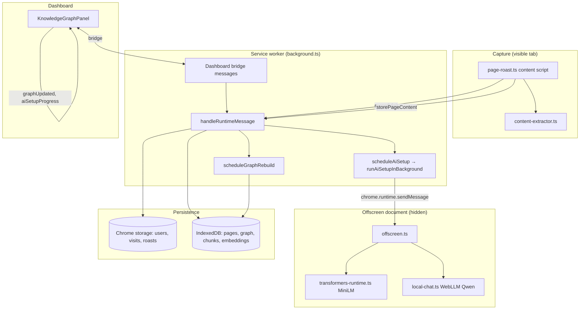

# Architecture overview

Shame The Web is a browser extension that playfully scores pages, builds a **local knowledge graph** from browsing history, and supports **on-device semantic search and chat** over that graph.

Nothing in the AI pipeline requires a remote inference server for core search/chat flows.

## System map

## Three parallel pipelines

The same page visit feeds **three loosely coupled pipelines**. They do not block each other synchronously.

| Pipeline | Trigger | Storage | Used for |
|----------|---------|---------|----------|
| **Visits / roast** | `recordVisit` message | Chrome `storage` | Scoring, visit history, live dashboard updates |
| **Page text** | `storePageContent` message | IndexedDB `pageContent` | TF-IDF search, chunk source text, graph node metadata |
| **Knowledge graph** | Debounced `scheduleGraphRebuild` (5s) | IndexedDB `knowledgeGraph` | Graph visualization, search graph-boost |
| **Semantic index** | Debounced `scheduleAiSetup` (1.5s) | IndexedDB `knowledgeChunks`, `chunkEmbeddings` | Semantic search, chat retrieval |

## Two indexes on the same pages

| Index | Built by | Query time |
|-------|----------|------------|
| **Graph** | `buildKnowledgeGraph` — keyword similarity + visit patterns | Graph neighbor boost in `semantic-search.ts` |
| **Vector** | `ensureSearchReady` — chunk + embed each page | Cosine similarity on chunk embeddings |

Search combines both at query time (semantic + keyword + graph + recency + visit frequency).

## RAG pattern

This is a classic **Retrieval-Augmented Generation** stack, adapted for the browser:

1. **Indexing** — chunk pages → embed chunks → store vectors (`ensureSearchReady`)
2. **Retrieval** — embed query → rank chunks/pages (`runSemanticSearch`)
3. **Generation** — pass top snippets + history to local LLM (`answerFromLocalKnowledge`)

Chat is layered on search: the dashboard always runs semantic search before attempting local chat.

## Key source files

| Concern | File |
|---------|------|
| Service worker entry | `extension/background.ts` |
| Page capture | `extension/src/contents/page-roast.ts` |
| Text extraction | `extension/src/lib/content-extractor.ts` |
| Chunking | `extension/src/lib/knowledge-chunks.ts` |
| AI setup / search orchestration | `extension/src/lib/ai-setup.ts` |
| Hybrid ranking | `extension/src/lib/semantic-search.ts` |
| Offscreen lifecycle | `extension/src/lib/offscreen-runtime.ts` |
| Offscreen AI handlers | `extension/offscreen.ts` |
| Shared types | `shared/src/index.ts` |

## AI setup phases

The dashboard observes `AiSetupStatus.phase` broadcast from the extension:

| Phase | Meaning |
|-------|---------|
| `idle` | Setup not started |
| `downloading_embed` | Loading MiniLM in offscreen doc |
| `indexing` | Chunking + embedding pages (`current` / `total`) |
| `ready_search` | Semantic search ready |
| `downloading_slm` | Loading WebLLM chat model |
| `ready_chat` | Local chat model ready |
| `error` | Setup failed (embeddings may still use fallback vectors) |

See [Local AI and search](./local-ai-and-search.md) for details.
